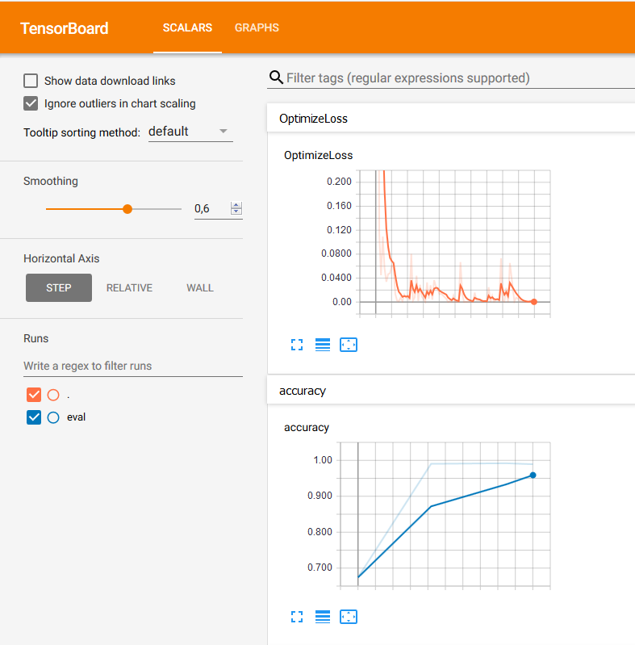
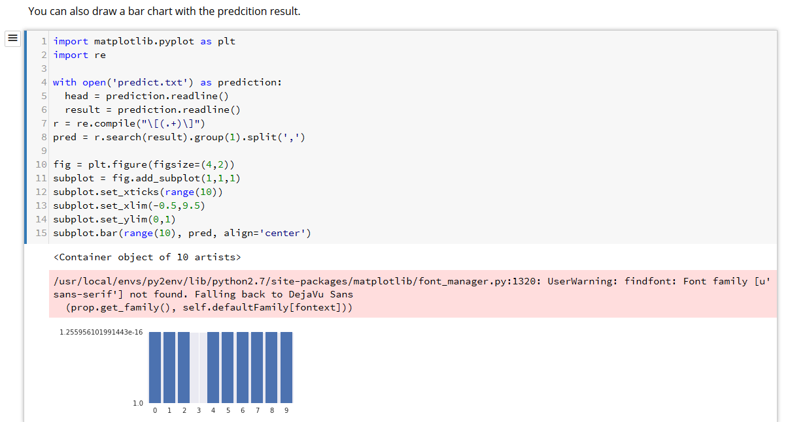

# Cloud Machine Learning Engine

Using a distributed configuration of TensorFlow code in Python on Cloud Machine Learning Engine to train a convolutional neural network model by using the MNIST dataset.

In this section, we will use Google cloud shell, to use an environment with all dependencies already installed, as described at https://cloud.google.com/ml-engine/docs/tensorflow/getting-started-training-prediction
Just open a cloud shell from the [Google Cloud Platform Console](https://console.cloud.google.com), and run this command to set your project ID :
```
gcloud config set project <project id>
```

Following this tutorial : https://cloud.google.com/ml-engine/docs/tensorflow/distributed-tensorflow-mnist-cloud-datalab,
first create a regional Cloud Storage bucket to hold the MNIST data files that are used to train the model.
```
$ BUCKET="bds-bdcf-test2-ml"
$ gsutil mb -c regional -l europe-west1 gs://${BUCKET}
Creating gs://bds-bdcf-test2-ml/...
```

Clone the distributed training example git repository https://github.com/GoogleCloudPlatform/cloudml-dist-mnist-example/, containing:
  * utils scripts
  * TensorFlow code to define the convolutional neural network model : https://github.com/GoogleCloudPlatform/cloudml-dist-mnist-example/blob/master/trainer/model.py
  * TensorFlow code to run the training task : https://github.com/GoogleCloudPlatform/cloudml-dist-mnist-example/blob/master/trainer/task.py

```
$ git clone https://github.com/GoogleCloudPlatform/cloudml-dist-mnist-example
$ cd cloudml-dist-mnist-example
```

Run the following script to download the MNIST data files:
```
$ ./scripts/create_records.py
Successfully downloaded train-images-idx3-ubyte.gz 9912422 bytes.
Extracting /tmp/data/train-images-idx3-ubyte.gz
Successfully downloaded train-labels-idx1-ubyte.gz 28881 bytes.
Extracting /tmp/data/train-labels-idx1-ubyte.gz
Successfully downloaded t10k-images-idx3-ubyte.gz 1648877 bytes.
Extracting /tmp/data/t10k-images-idx3-ubyte.gz
Successfully downloaded t10k-labels-idx1-ubyte.gz 4542 bytes.
Extracting /tmp/data/t10k-labels-idx1-ubyte.gz
Writing /tmp/data/train.tfrecords
Writing /tmp/data/validation.tfrecords
Writing /tmp/data/test.tfrecords
```

Copy files to the bucket created above :
```
$ gsutil cp /tmp/data/train.tfrecords gs://${BUCKET}/data/
Copying file:///tmp/data/train.tfrecords [Content-Type=application/octet-stream]...
- [1 files][ 46.7 MiB/ 46.7 MiB]
Operation completed over 1 objects/46.7 MiB.

$ gsutil cp /tmp/data/test.tfrecords gs://${BUCKET}/data/
Copying file:///tmp/data/test.tfrecords [Content-Type=application/octet-stream]...
- [1 files][ 8.5 MiB/ 8.5 MiB]
Operation completed over 1 objects/8.5 MiB.
```

Submit a training job to Cloud ML Engine.
```
$ JOB_NAME="job_$(date +%Y%m%d_%H%M%S)"
$ gcloud ml-engine jobs submit training ${JOB_NAME} \
--package-path trainer \
--module-name trainer.task \
--staging-bucket gs://${BUCKET} \
--job-dir gs://${BUCKET}/${JOB_NAME} \
--runtime-version 1.2 \
--region europe-west1 \
--config config/config.yaml \
-- \
--data_dir gs://${BUCKET}/data \
--output_dir gs://${BUCKET}/${JOB_NAME} \
--train_steps 10000

Job [job_20180529_131558] submitted successfully.
Your job is still active. You may view the status of your job with the command
$ gcloud ml-engine jobs describe job_20180529_131558
or continue streaming the logs with the command
$ gcloud ml-engine jobs stream-logs job_20180529_131558
jobId: job_20180529_131558
state: QUEUED
```

The amount of resources allocated for the training can be controlled by settings provided in the file provided above in argument ```--config config/config.yaml```
Here this file [config/config.yaml](https://github.com/GoogleCloudPlatform/cloudml-dist-mnist-example/blob/master/config/config.yaml) contains :

```
trainingInput:
# Use a cluster with many workers and a few parameter servers.
scaleTier: STANDARD_1
```

The documentation at https://cloud.google.com/ml-engine/reference/rest/v1/projects.jobs#scaletier describes other possible settings for ScaleTier.


Check the job status from time to time .
After 11 minutes, the job finished successfully :
```
$ gcloud ml-engine jobs describe job_20180529_131558
createTime: '2018-05-29T11:16:03Z'
endTime: '2018-05-29T11:27:37Z'
jobId: job_20180529_131558
startTime: '2018-05-29T11:20:32Z'
state: SUCCEEDED
trainingInput:
args:
- --data_dir
- gs://bds-bdcf-test1-ml/data
- --output_dir
- gs://bds-bdcf-test1-ml/job_20180529_131558
- --train_steps
- '10000'
jobDir: gs://bds-bdcf-test1-ml/job_20180529_131558
packageUris:
- gs://bds-bdcf-test1-ml/job_20180529_131558/89e4ed7e906fab71ccbebaf85e4634980aab4b03332bb889e84da06e70a61f94/trainer-0.0.0.tar.gz
pythonModule: trainer.task
region: europe-west1
runtimeVersion: '1.2'
scaleTier: STANDARD_1
trainingOutput:
consumedMLUnits: 0.73
```

The Cloud console is then showing graphs of resources consumption for the Parameters nodes and worker nodes that were used during the training :


After the training, the trained model is exported in the storage bucket.
You can find the storage path for the directory that contains the model binary by using the following command:
```
$ gsutil ls -R gs://bds-bdcf-test2-ml/job_20180529_131558/export/Servo
gs://bds-bdcf-test2-ml/job_20180529_131558/export/Servo/:
gs://bds-bdcf-test2-ml/job_20180529_131558/export/Servo/
gs://bds-bdcf-test2-ml/job_20180529_131558/export/Servo/1527593250/:
gs://bds-bdcf-test2-ml/job_20180529_131558/export/Servo/1527593250/
gs://bds-bdcf-test2-ml/job_20180529_131558/export/Servo/1527593250/saved_model.pb
gs://bds-bdcf-test2-ml/job_20180529_131558/export/Servo/1527593250/variables/:
gs://bds-bdcf-test2-ml/job_20180529_131558/export/Servo/1527593250/variables/
gs://bds-bdcf-test2-ml/job_20180529_131558/export/Servo/1527593250/variables/variables.data-00000-of-00001
gs://bds-bdcf-test2-ml/job_20180529_131558/export/Servo/1527593250/variables/variables.index
```

You can visualize the training process with TensorBoard.

First run in cloud shell :
```
tensorboard --port 8080 --logdir gs://${BUCKET}/${JOB_NAME}
```
Select Preview on port 8080 from the Web preview menu in the top-right corner of the Cloud Shell toolbar :


A new tab appears with TensorBoard graphs :



## Predictions

Deploy the model in Cloud Machine Learning Engine:
```
$ MODEL_NAME=MNIST
$ gcloud ml-engine models create --regions europe-west1 ${MODEL_NAME}
Created ml engine model [projects/xxx/models/MNIST].


$ VERSION_NAME=v1
$ ORIGIN=$(gsutil ls gs://${BUCKET}/${JOB_NAME}/export/Servo | tail -1)
$ gcloud ml-engine versions create \
         --origin ${ORIGIN} \
         --model ${MODEL_NAME} \
         ${VERSION_NAME}
Creating version (this might take a few minutes)......done.
```

It took around 5 minutes.

Make this version the default version:

```
$ gcloud ml-engine versions set-default --model ${MODEL_NAME} ${VERSION_NAME}
createTime: '2018-05-29T11:42:44Z'
deploymentUri: gs://bds-bdcf-test1-ml/job_20180529_131558/export/Servo/1527593250/
framework: TENSORFLOW
isDefault: true
name: projects/xxx/models/MNIST/versions/v1
pythonVersion: '2.7'
runtimeVersion: '1.0'
state: READY
```

Cloud Machine Learning Engine doesn't accept as input an image. It expects a list of instance data tensors. The git repository provides a utility that will translate 10 test images into a data tensors stored in a JSON file.

Run this script to get a sample requets file request.json created :

```
$ ./scripts/make_request.py
```

Run the prediction using as input the request.json file just generated.

The output should provide in the column CLASSES the most probable digit, and in the column PREDICTIONS, probabilities for each digit:
```
$ gcloud ml-engine predict --model ${MODEL_NAME} --json-instances request.json
CLASSES PROBABILITIES
7 [2.377906188169904e-19, 8.500697297767965e-15, 5.356267766755242e-17, 6.070074739853955e-16, 8.418050069642876e-16, 2.991454877812784e-16, 3.53302
29948170736e-22, 1.0, 2.864475279470733e-19, 6.201324040866138e-14]
2 [1.0261104692059874e-16, 1.0165506674278402e-14, 1.0, 5.376825442888482e-23, 1.9558034179083954e-19, 1.303478261046465e-25, 4.025023637555468e-18,
2.734137663308793e-25, 6.0538582113607106e-18, 3.367482767910528e-21]
1 [1.0935188069863627e-16, 1.0, 1.4027876116837288e-14, 3.5024177766339126e-20, 6.167368393761308e-09, 1.6811160482351623e-13, 5.067352584092223e-14
, 1.4383805778395153e-11, 2.319349410879329e-13, 4.049853118002472e-17]
0 [1.0, 9.872036651350862e-17, 1.0314330363110982e-14, 4.157342922498023e-17, 1.0775232118172859e-15, 1.2777082892417597e-14, 4.705068257747358e-13,
7.434289593438378e-16, 4.544854275468659e-16, 4.342549323604894e-12]
4 [4.177642182884258e-18, 6.776674389013821e-15, 5.290839897884665e-16, 9.323272641429866e-22, 1.0, 5.022184128663414e-15, 6.10716175981213e-14, 1.1
113336542255964e-14, 3.772323707747216e-13, 2.339680393870225e-10]
1 [7.966584155734294e-16, 1.0, 3.665658407240105e-14, 7.675418726649318e-19, 1.4747633114708947e-09, 6.022533003986058e-14, 1.611045654249365e-14, 4
.669234998644356e-10, 5.9845678759828935e-12, 4.2867450722923483e-16]
4 [2.000526133260554e-20, 2.3539628579705152e-11, 3.2325373423207435e-15, 4.1000785224763366e-24, 1.0, 6.263503289568066e-15, 8.918625928923396e-13,
1.347356335659397e-13, 4.062497538370735e-08, 1.4860698392335503e-12]
9 [9.139061984400274e-17, 1.1760067796824777e-15, 1.0367541027067606e-11, 6.670412517593993e-16, 9.725931171544744e-11, 1.0350750238744075e-14, 1.76
42558090784203e-17, 1.0150311326721133e-15, 1.0179642906393838e-08, 1.0]
5 [2.4535798393010566e-10, 3.1178996016956173e-12, 9.703891336310111e-14, 9.258166463487253e-16, 3.516180186124984e-06, 0.9992265701293945, 4.542330
134427175e-05, 3.1569278441390125e-12, 0.0007209778414107859, 3.5418083825788926e-06]
9 [8.886568049249394e-20, 7.70490451016196e-18, 2.3267215362568942e-21, 7.617361060107173e-22, 8.179201671509873e-08, 1.5562026796645927e-16, 6.7069
57717267893e-21, 8.015372220115946e-12, 1.1385565407140419e-10, 0.9999998807907104]
```

## Executing predictions with Cloud Datalab

For a more user-friendly interface to Cloud Machine Learning Engine, Cloud Datalab allows you to run notebooks.
The git repository contains an interactive notebook at https://github.com/GoogleCloudPlatform/cloudml-dist-mnist-example/blob/master/notebooks/Online%20prediction%20example.ipynb allowing a user to draw a digit and ask predictions to our model deployed in Cloud ML Engine.

First in Cloud Shell, create a Cloud Datalab instance:
```
$ datalab create mnist-datalab --zone europe-west1-b
Creating the network datalab-network
Creating the firewall rule datalab-network-allow-ssh
Creating the disk mnist-datalab-pd
Creating the repository datalab-notebooks
Creating the instance mnist-datalab
Created [https://www.googleapis.com/compute/v1/projects/xxx/zones/europe-west1-b/instances/mnist-datalab].
Connecting to mnist-datalab.
This will create an SSH tunnel and may prompt you to create an rsa key pair. To manage these keys, see https://cloud.google.com/compute/docs/instances/addi
ng-removing-ssh-keys
Waiting for Datalab to be reachable at http://localhost:8081/
This tool needs to create the directory [/home/user/.ssh]
before being able to generate SSH keys.
Do you want to continue (Y/n)? Y
Generating public/private rsa key pair.
Enter passphrase (empty for no passphrase):
Enter same passphrase again:
Your identification has been saved in /home/user/.ssh/google_compute_engine.
Your public key has been saved in /home/user/.ssh/google_compute_engine.pub.
The key fingerprint is:
SHA256:xxx user@cs-6000-devshell-vm-xxx
The key's randomart image is:
+---[RSA 2048]----+
xxx
+----[SHA256]-----+
Updating project ssh metadata.../Updated [https://www.googleapis.com/compute/v1/projects/xxx].
Updating project ssh metadata...done.
Waiting for SSH key to propagate.
The connection to Datalab is now open and will remain until this command is killed.
Click on the *Web Preview* (square button at top-right), select *Change port > Port 8081*, and start using Datalab.
```

Following the instructions above, we go tour our Datalab instance home page :


Create a new notebook by clicking on ```+Notebook```.

Paste the following text into the first cell of the new notebook.
```
%%bash
wget https://raw.githubusercontent.com/GoogleCloudPlatform/cloudml-dist-mnist-example/master/notebooks/Online%20prediction%20example.ipynb
cat Online\ prediction\ example.ipynb > Untitled\ Notebook.ipynb
```

like this :


Click the ```Run``` command at the top of the page to download the ```Online prediction example.ipynb``` notebook and copy its contents into the current notebook :


Go back to the tab from where we created the noteboook, and see a new notebook ```Online Prediction example``` appears now :


Select this notebook, then browse down to find a cell where you can draw :


Draw a digit with your mouse :


Click in the next cell (where you see MODEL_NAME="MNIST") to activate it and then click on the down arrow next to the Run button at the top of the window and select Run from this Cell:


You see just above text predictions, showing a 3 is predicted.

The end of the page is also exposing predictions as a bar chart :


