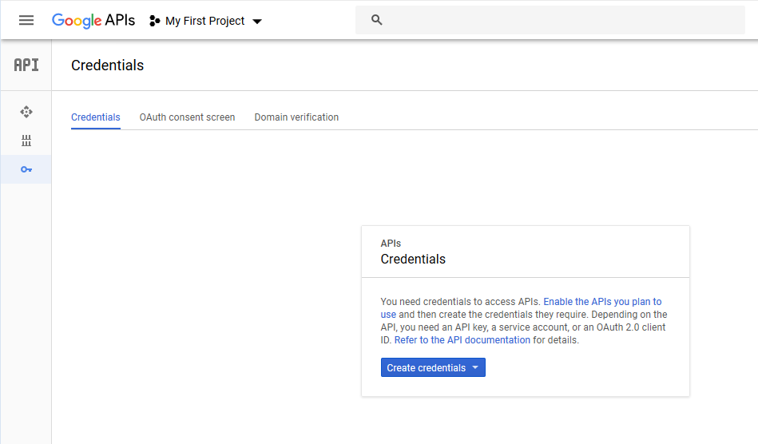
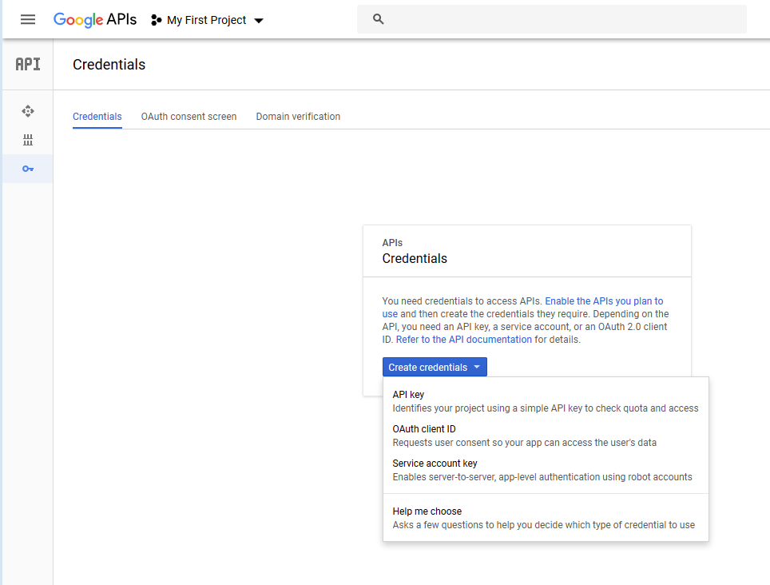
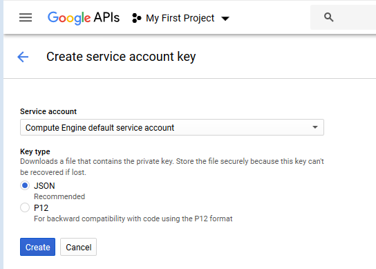

# Setup

Go to the [Google Cloud Platform Console](https://console.cloud.google.com), sign up and create a new project.

On your host, download and install the [gcloud SDK](https://cloud.google.com/sdk/) following this [documentation](https://cloud.google.com/sdk/docs/quickstart-linux) (here for linux).

Once done, add additional dependencies that wil be used in the  [Kubernetes Engine section](kubernetes-engine.md) :
```
gcloud components install kubectl
```

Another alternative, that will be used in the  [Cloud Machine Learning section](cloud-ml-engine.md), is to use [Google Cloud Shell](https://cloud.google.com/shell/docs/), a shell environment with all required dependencies already installed for managing resources hosted on Google Cloud Platform.


## Creating API keys

Google API client applications running outside of Google Cloud Platform, for example the [Terraform Google Cloud Provider](https://www.terraform.io/docs/providers/google/index.html), can reference API keys to authenticate against Google Cloud APIs.

API keys are generated from the API console at https://console.developers.google.com/.
In the left-hand side menu, select Credentials :



Select Create Credentials and Service Account Key :



Click on Create to download a JSON file containing API keys :



References:
  * [Google Cloud Platform documentation](https://cloud.google.com/docs/)
  * [Terraform Google Cloud Provider configuration](https://www.terraform.io/docs/providers/google/index.html#configuration-reference)

Next: [Compute Engine](compute-engine.md)